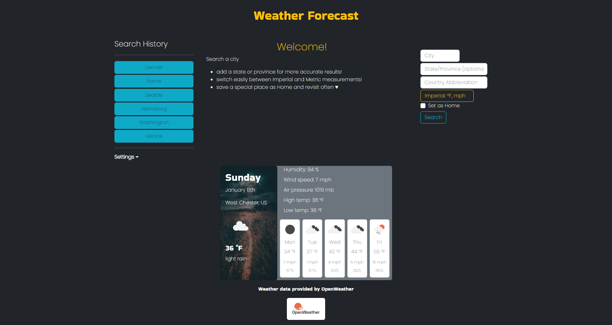
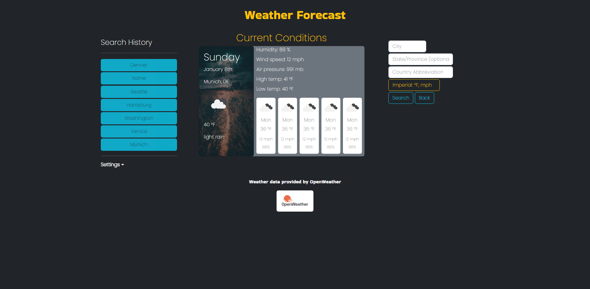

# 5-day-weather-forecast

## Description

The motivation behind building this app was to solve the problem of needing to know the weather in more than one place, perhaps because family and friends are scattered around the world or perhaps because of an upcoming long-distance trip or outdoor excursion. For whatever the reason, knowing the weather can be an invaluable everyday tool for all sorts of people. This project specifically aims to provide the weather of a special place, such as a home address, and give updates every ten minutes.

I learned that a project of this size has many moving parts and pieces, and that proactively planning functionality as much as possible early on is an incredible asset. It is also clear with this project that many functions are used and reused in different ways. I learned that implementing a JavaScript file called "utils.js" would have been a great way to extract reusable functions that are shared by several different user interfaces.

## Installation

N/A. [Deployed site here!](https://miacias.github.io/five-day-weather-forecast/)

## Usage

1. Select the form inputs and type in a city by name and country abbreviation. To be retrieve the desired city's weather, it is recommended to also specify the state or province code in the event that there is more than one city of the same name within the given country.
2. Set the toggle to Imperial or Metric to ensure desired system of measurement (Imperial is default)
3. If searching for home city, select Set as Home checkbox, otherwise leave it unchecked (unchecked is default)
4. Click or tap the Search button to display weather
5. To revisit a past search, click the desired Search History button
6. To return to home after viewing weather in other cities, click the Back button
7. To empty and remove the search history, click Settings and select Clear History
8. To empty and remove a saved home city, click Settings and select Clear Home

Below is an image of the home page:

Below is an image of the results page:

## Features 

- landing page displays static text with easy to read instructions on how to get started
- form inputs have placeholder text prompts on how to use
- imperial / metric toggle allows specifying units of measurement before search
- set as home checkbox allows saving a home address, which provides updated weather in a 10 min interval
- home city can be set and reset or cleared entirely as needed
- home city is visible or hidden on landing page depending on if it is set
- searching cities other than home city redirects to a results page
- search history sidebar displays previously searched cities with clickable buttons
- search history buttons display weather of given city when clicked

## Roadmap
Content will be added and adjusted as new coding projects are available! Some projects may phase out over time as my work becomes more specialized. Some desired features and functionality to be added in the future:
- persist most recent search on screen after refresh
    1. Create a third localStorage keyword that stores the last / most recent search item (excluding Home City)
    2. Adjust functions that collect and post weather to focus on this new localStorage key. Remove references to other localStorage keys from functions that post weather to the screen
    3. This new localStorage keyword collects data from form submit and search history button click
    4. A new form submit or button click overwrites the stored data, similar to how the Home City can be overwritten
- adapt weather card background image depending on main weather event: 
    - thunderstorm (current image)
    - drizzle or rain
    - snow
    - clear
    - clouds
    - atmosphere
- ensure mobile-friendly responsive view using Bootstrap classes and breakpoints
- update live view of units of measure when switching toggle back and forth between imperial and metric systems instead of measurements set on search
- verify that air pressure measurements are accurate and/or create a conversion function as needed. Air pressure returned values appear suspiciously high

## Credits

Documentation referenced:
- Mozilla Developer Network
- Slack Overflow forums
- Day.js.org
- Bootstrap
- OpenWeather

Tutorials referenced:
- Samantha Ming, [SamanthaMing.com](https://www.samanthaming.com/tidbits/86-window-location-cheatsheet/) - window location
- Moomez Blog, [YouTube](https://www.youtube.com/watch?v=Atc0qPkDeKM) - Bootstrap toggle
- [JavaScriptTutorial.net](https://www.javascripttutorial.net/javascript-return-multiple-values/) - returning multiple values from one function

Tutor credit:
- Alexis San Javier [GitHub](https://github.com/code-guy21)
    - value of utils.js file
    - Bootstrap vs jQuery values - Bootstrap overrides jQuery if the file loads last in HTML
    - destructuring discussions
    - comparison functions work most consistently with all lowercase
    - [JS URL functions](https://javascript.info/url)
- Mia Dilberovic [GitHub](https://github.com/Dilberovicka31) - how to organize HTML to pair with jQuery methods .append() versus .text()
- Zack Campanelli - Bootstrap flexbox

U Penn Bootcamp study groups: 
- [Fredrick Chang](https://github.com/LearnedDr)
- [Stevie O'Connell](https://github.com/OConnell-Coder)
- [Josh Eflin](https://github.com/JoshEflin)
- [Dan Gardner](https://github.com/gardnerd06)

U Penn Bootcamp instructor(s): Dan Gross

Artists: 
- Jonathan Bowers [Unsplash.com](Unsplash.com) - thunderstorm photograph

Weather data provided by [OpenWeather](https://openweathermap.org/) 

## License 

 Please refer to the LICENSE in the repo.